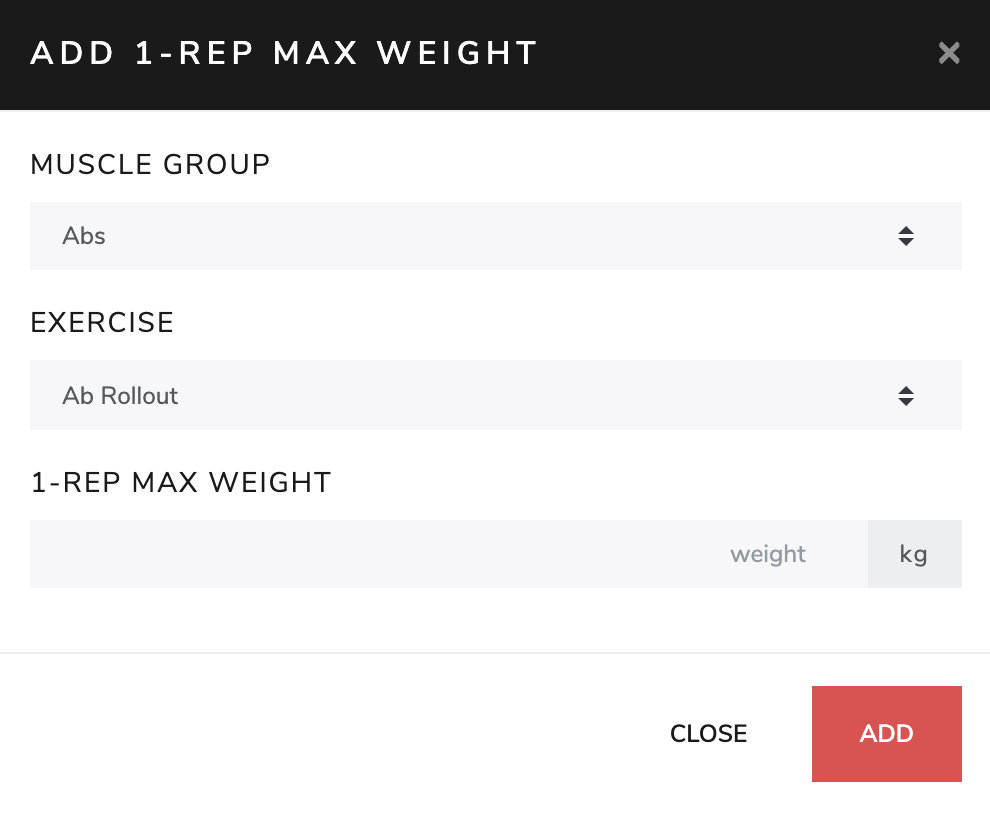

# [Fitbook](http://34.72.208.138)

## What is Fitbook

Fitbook is a web application which tracks the workout information and in helps of improving effectiveness of exercise.

## How to use

This section explains how to setup and use Fitbook step by step.  

* [register](#register)
* [login](#login)
* [record](#record)
    * [strength exercise](#strength-exercise)
    * [cardio exercise](#cardio-exercise)
    * [1-rep max weight](#1-rep-max-weight)
    * [body information](#body-information)
        * [body weight](#body-weight)
        * [muscle weight](#muscle-weight)
        * [fat rate](#fat-rate)

## Register

In order to track workout information, Fitbook needs to know who are you, so you need to create an account for storing your information. The following steps will help you to create your account.  
1. Going to "Register" page by clicking the top-right "Register" menu item.
2. Fill the "username" input which will be used for login in the future, the username must be alphanumeric and the length of it must be between 5 and 15.
3. Fill the "password" input which belongs to the username for future authentication, this password must be alphanumeric and length of it must be between 5 and 15.
4. Fill the "confirmation" input which must be as same as password for double check. 
5. Click "submit" to create your account.

## Login

Before starting recording workout information, you need to log in to Fitbook for identifying the recorded information belonged to whom.

1. Going to "Login" page by clicking the top-right "Log in" menu item.
2. Fill the "username" input with which you have registered.
3. Fill the "password" input with which you have registered.
5. Click "submit" to log in to Fitbook.

## Record

The following paragraph will help you to record your workout information step by step.

1. After logging in Fitbook, go to "Record" page by clicking the top-left "Record" menu item for starting recording.
2. Specifying the date you want to record in by selecting date in "Date" input or clicking date in calendar.
3. Starting recording variant information, including "strength exercise", "cardio exercise", "1-rep max weight", "body information", the following sections will guide you how to do so.

## Strength Exercise

Strength Exercise is equivalent to weight training in Fitbook, follow the steps in this section to track your weight training records.

1. Click "Add Exercise" in "Record" page to open "Add Exercise" popup dialog.
2. Selecting the muscle group which you want to track in "Muscle Group" input.
3. Selecting the exercise which you want to track in "Exercise" input.
4. Add the number of sets you have trained by clicking "Add Set" button the same number of times.
5. "Add Set" will generate the input for recording what weight and repetition you have trained, fill it.
6. After filling all the inputs, click "Add" to complete the record.

## Cardio Exercise

Cardio Exercise is equivalent to aerobic exercise in Fitbook, follow the steps in this section to track your aerobic exercise records.

1. Click "Add Exercise" in "Record" page to open "Add Exercise" popup dialog.
2. Selecting the exercise which you want to track in "Exercise" input.
3. Filling the time you have trained in "HRS"(hours), "MINS"(minutes), "SECS"(seconds) inputs, empty input represents 0.
4. After filling all the inputs, click "Add" to complete the record.

## 1-Rep Max Weight

1-Rep Max Weight is used to record the maximum weight of which exercise that you can do in what date, follow the steps in this section to track your 1rm records.

1. Click "Add 1-Rep Max Weight" in "Record" page to open "Add 1-Rep Max Weight" popup dialog.
2. Selecting the muscle group which you want to track in "Muscle Group" input.
3. Selecting the exercise which you want to track in "Exercise" input.
4. Filling the maximum weight that you can do in "1-Rep Max Weight" input.
5. After filling all the inputs, click "Add" to complete the record.

## Body Information

Body Information including "Body Weight", "Muscle Weight" and "Fat Rate", the following sections will guide you how to do so.

## Body Weight

Body Weight is as its literal expression, is used to record body weight in kilogram in Fitbook.

1. Click "Edit" button which is represented in icon at the right side of "Weight" input in "Record" page to enter edit mode.
2. Filling your weight in "Weight" input in kilogram.
4. After filling, click "Save" button, which is represented in icon at the right side of "Weight" input, to complete the record.

## Muscle Weight

Muscle Weight is as its literal expression, is used to record muscle weight in kilogram in Fitbook.

1. Click "Edit" button which is represented in icon at the right side of "Muscle" input in "Record" page to enter edit mode.
2. Filling your muscle weight in "Muscle" input in kilogram.
4. After filling, click "Save" button, which is represented in icon at the right side of "Muscle" input, to complete the record.

## Fat Rate

Fat Rate is as its literal expression, is used to record fat rate in percent in Fitbook.

1. Click "Edit" button which is represented in icon at the right side of "Fat" input in "Record" page to enter edit mode.
2. Filling your fat rate in "Fat" input in percent.
4. After filling, click "Save" button, which is represented in icon at the right side of "Fat" input, to complete the record.